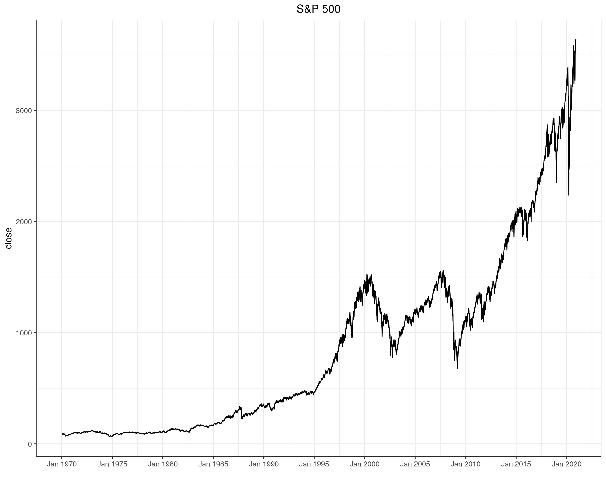
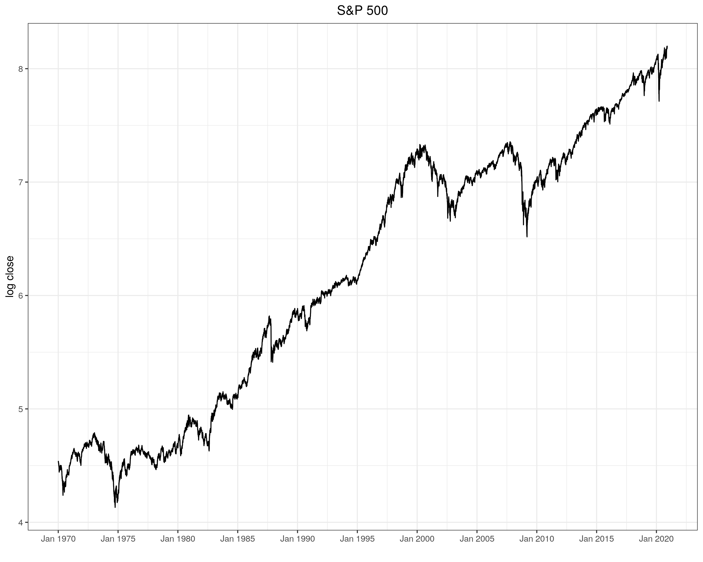

# finance_playground

```bash
sudo docker build -f ~/finance_playground/Dockerfile ~/finance_playground --tag=finance_playground
sudo docker run -it -v ~/finance_playground:/home/finance_playground finance_playground bash
R -q
source("explore.R")
```






